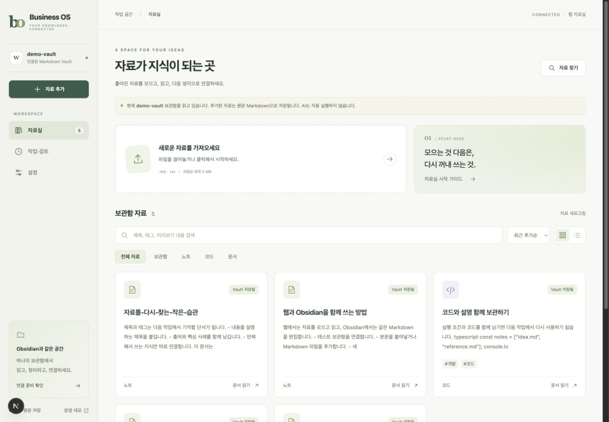
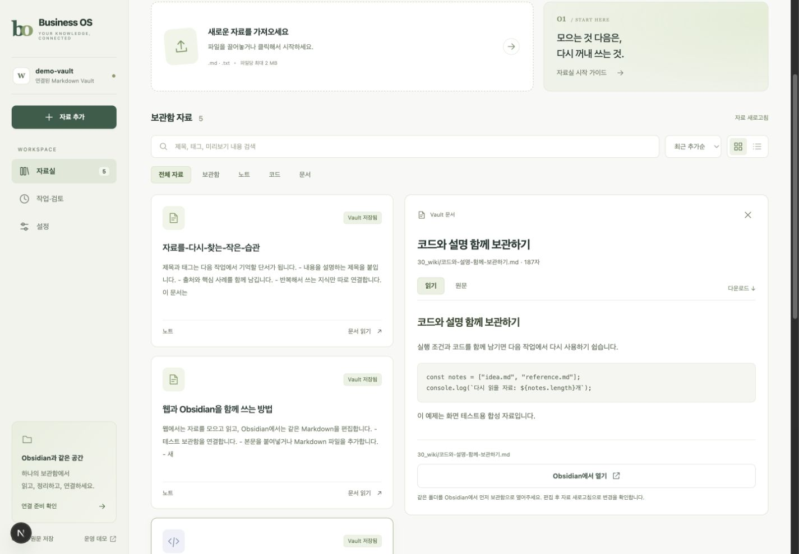
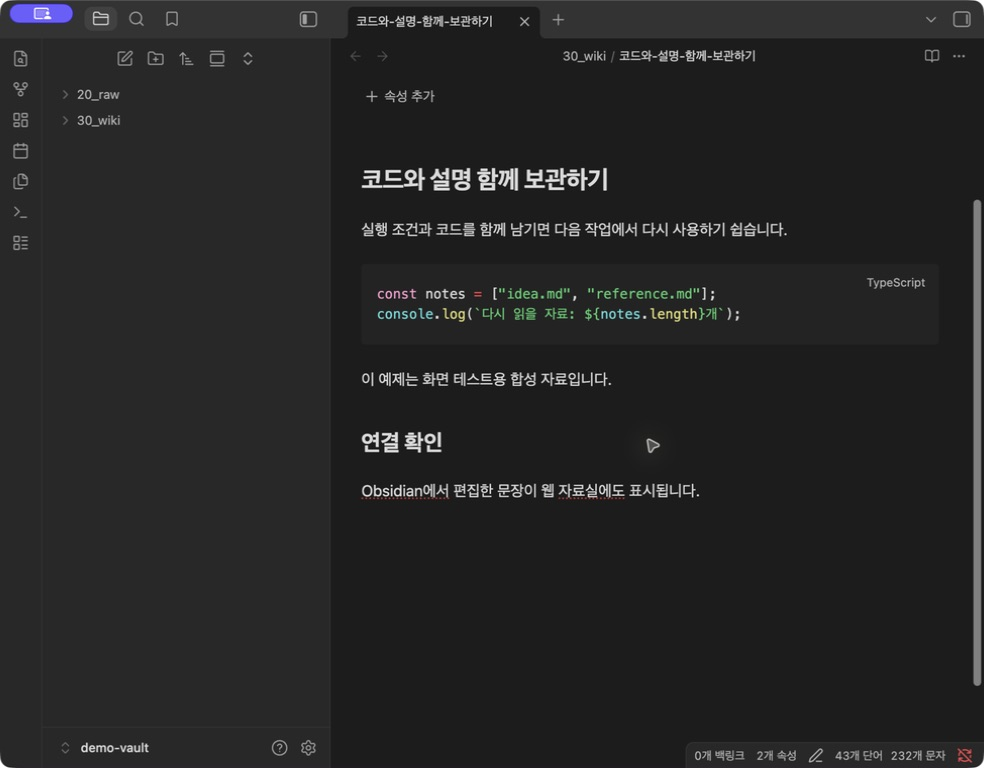

# Business OS · obsidianOs

**English** | [한국어](README.ko.md)

A local-first knowledge and operations foundation for Obsidian, Markdown, and AI-assisted workflows.

Turn source material into readable articles and reusable knowledge, then bring that knowledge into company workflows. Personal knowledge and company data remain separate.

**Early development / local demo.** The web library now connects to a local Markdown Vault, reads existing notes, and saves imported files or pasted text as Raw originals. Connection settings and saved documents survive refreshes and service restarts. The first M2.1 slice supports persistent local Raw preservation and AI Article generation through a separate CLI. An optional CLI mode now records processing jobs, attempts, events and per-call usage in PostgreSQL. Automatic crash recovery, Obsidian processing commands, and the full approval/execution flow are still in development. This is not yet a production or public-server release.



*Working local web UI, captured September 17, 2026 with synthetic data. The application currently uses Korean labels; the UI will continue to evolve.*

## What we are building

```text
Source → Preserved Raw → Faithful Article → Optional Wiki updates → Reuse in the next task
```

Preserve the original and produce an article that retains its examples, numbers, and code. Update the Wiki only when there is reusable knowledge to add. The longer-term goal is to connect that knowledge to planning, approval, execution, and measurement.

| Available now | Next to implement |
|---|---|
| Local CLI for Raw preservation, supplied drafts, and AI Articles | Automatic crash recovery and checkpoints |
| Reuse of completed requests and manual-edit conflict detection | Per-segment checkpoints and real-source quality evaluation |
| Public Obsidian sample Vault and structure/link checks | Obsidian processing commands and shared web task views |
| Local Vault connection, persistent file/text imports, search, reading, and Obsidian links | Web AI processing, URL capture, and live file-change detection |
| Operations Demo and initial DB views at `/operations` | Reviewed, approved Wiki changes and section-level retrieval |

**Language coverage:** this README is available in English and Korean. The current AI Article policy generates Korean text; detailed design documents and the sample Vault are also mostly in Korean. Selecting a README language does not change the application or generation language.

[Quick start](#quick-start) · [Process a source](#process-a-source) · [Obsidian](#use-with-obsidian) · [First use](#first-use) · [Roadmap](#roadmap-and-contributing)

## Quick start

The Demo and automated tests require **no API key or database**. Use Node.js 24+, Git, and the pnpm version pinned in [package.json](package.json). Run commands from the repository root.

```sh
git clone https://github.com/zmakerz/obsidianOs.git
cd obsidianOs
corepack pnpm install --frozen-lockfile
corepack pnpm test
corepack pnpm demo
corepack pnpm dev
```

If Corepack is unavailable, install pnpm 11.19.0 and omit the `corepack` prefix. No `.env` file is needed for Demo mode. Leave `DATABASE_URL` unset to keep the operations Demo in sample mode. Setting it switches `/operations` to PostgreSQL mode; Vault browsing and Raw imports work without PostgreSQL or API credentials.

Open [the local library](http://127.0.0.1:3000). The dev/start commands bind to loopback. The previous [operations Demo](http://127.0.0.1:3000/operations) remains available separately; its sample KPIs, suggestions, and activities are synthetic, and Demo approval buttons are disabled.

## First use

Run from source with the commands above. A packaged installer and automatic database setup are still planned.

1. Open **설정** (Settings) → **테스트 보관함으로 시작** (Start with a test Vault). This creates a separate local Vault with three synthetic notes and enables Raw imports. No API key or database is needed.
2. Choose **자료 추가** (Add material), then upload a UTF-8 `.md`/`.txt` file or paste a title and body. The original is saved as Markdown under `20_raw/document/`; no AI runs automatically.
3. Refresh the browser. The connection and saved document should remain. Search, switch cards/list, open a document, and compare **읽기** (Read) with **원문** (Source).
4. In Obsidian, use **Open folder as vault** and select the same folder shown in Settings. Then the reader's **Obsidian에서 열기** (Open in Obsidian) link targets that exact file. The app must be installed and the browser must allow external-app links. If an embedded browser does nothing, open the same local web address in Safari or Chrome and allow the external app prompt.
5. Edit an ordinary test note in Obsidian, then click **자료 새로고침** (Refresh material) on the web. Changes are read from disk. Imported Raw originals are intended to remain unchanged.



*The reader uses the same Markdown files as Obsidian. This screenshot shows a synthetic code note; it is not an AI-generated result.*



*The added connection-check paragraph was subsequently read back in the web workspace.*

### Connect your own Vault

In Settings, enter an existing **absolute Vault path** and comma-separated **relative folders** such as `30_wiki, 80_outputs/articles`. Use `.` only when you intend to browse the whole Vault. Hidden folders and symbolic links are excluded. Existing notes do not need this project's frontmatter or IDs and are never rewritten by connecting.

Connections start read-only unless you check **새 자료를 20_raw/document에 원문으로 저장하도록 허용**. This authorizes new Raw originals in that folder, which is also included in the library. The web does not overwrite or delete existing notes. Repeated imports with the same source content reuse the existing Raw; manual edits to a stored Raw produce a conflict. Disconnecting removes the connection setting, not the files.

With the standard commands, settings are stored in `apps/control-tower/.business-os/vault.json` and the test Vault in `apps/control-tower/.business-os/demo-vault/`. Both are local and Git-ignored. A custom launch directory changes the `.business-os/` location. Real source material belongs in a private Vault, outside the tracked public sample `vault/`.

### Current limits and verification

- This is a local, single-operator web app. Writes require a loopback host, matching origin, and local session. It is not a multi-user authentication system.
- Lists scan at most 300 documents / 3,000 entries, to a depth of 12. They read up to 8 KB per file and return a 1,200-character body preview. Search covers listed titles, tags, paths, and previews—not full-Vault semantic search. Narrow the selected folders if the limit is reached.
- Selecting a document reads its full body (files up to 2.1 MB including metadata). The reader shows up to 50,000 characters; download exports the full **body**, without Vault frontmatter. Basic headings, lists, and code render; HTML is not executed. Obsidian-specific syntax and attachments are not fully rendered.
- Imports accept UTF-8 text up to 2 MB per file, 20 files / 10 MB per batch. Connected imports persist on disk. **Before connecting**, the sample workspace is a tab-only preview; unsaved additions disappear on refresh. Title/tag editing and reversible list removal apply only to this temporary preview.
- Local requests time out after 30 seconds instead of waiting indefinitely. A lost write response is reported as unconfirmed: refresh the library to check whether it saved before retrying. No automatic write retry runs.
- Changes made outside the web require manual refresh. Web AI generation, API-key setup, URL/PDF capture, persistent job recovery, and Wiki approval are still pending. AI Article generation is available separately through the CLI below.

Verified with synthetic data: browser file upload and pasted text → Raw on disk → refresh → full-body reading, plus automated read-only/scope checks, duplicate protection, external-edit rereading, and settings reload in a fresh process. On macOS, Safari → Open in Obsidian → edit a synthetic note → refresh the web reader was also verified with Obsidian 1.13.7. The tested embedded browser did not launch the external app; use a regular browser for that step. Service restart restored the connection and all five test documents.

See the [product workflow](docs/PRODUCT.md#웹-중심의-첫-사용과-일상-흐름) and [implementation sequence](docs/MILESTONES.md#m22--웹-설정자료실--obsidian-연결--선택적-wiki) for the remaining work.

## Process a source

This is the first M2.1 implementation. Keep real documents in a private Vault or the Git-ignored `local-vault/` directory, rather than the public sample `vault/`. Replace the absolute paths below with your own. The target Vault directory must already exist.

### Save a supplied draft without an API call

Both the source and draft must be inside the specified `--source-root`.

```sh
corepack pnpm knowledge:process -- --vault "/absolute/private-vault" --source-root "/absolute/input" --source "/absolute/input/source.md" --title "Source title" --source-type web --url "https://example.com/article" --domain general --draft "/absolute/input/draft.md"
```

### Generate an Article with AI

Use [.env.example](.env.example) as a reference and set `OPENAI_API_KEY` in the repository-root `.env.local`. Replace `--draft ...` in the command above with `--ai`. This explicitly sends the selected source body to OpenAI and incurs API usage charges.

The adapter is configured to use `gpt-5.6-terra` by default, with an `OPENAI_MODEL` override. Compatibility with the adapter's reasoning options must be checked when changing models.

```sh
# Optional paid connectivity check requesting a short OK response.
# This is not part of the automated test suite.
corepack pnpm check:openai
```

### Outputs and behavior

| Output | Location | Purpose |
|---|---|---|
| Raw | `20_raw/<source_type>/date-title-hash.md` | Preserve the source body and line endings; verify with SHA-256 |
| Article | `80_outputs/articles/date-title-hash.md` | Store the review-pending draft, source ID/link, generation policy, and usage when available |
| Daily log | `90_logs/YYYY-MM-DD.md` | Append result summaries; does not replace the job database |

- Input is a UTF-8 `.md` or `.txt` file. The whole file is preserved. Capture frontmatter extraction, web/YouTube fetching, and binary/PDF imports are not implemented yet.
- Document IDs are separate from filenames. Repeating the same source/content/policy request returns the existing result without another AI call. Changed content or model/policy produces a separate result.
- Existing Raw/Article content is not overwritten. Manual edits or stale source links after a Raw move produce a conflict requiring review. This command does not delete Inbox items or create Wiki pages.
- Supplied drafts and AI-generated Articles are distinguished; both remain pending review.
- Empty or URL-only input returns `needs-input`. Model errors, truncated responses, or missing code blocks fail the request and preserve Raw. These checks do not guarantee factual or writing quality.
- AI input is split without breaking paragraphs or fenced code blocks: up to 12,000 characters per segment, 8 calls, and 8,192 output tokens per response. There are no automatic retries. Oversized indivisible blocks or inputs exceeding the call budget fail explicitly rather than being silently truncated.

The service currently supports one local writer. Concurrent writes are rejected through `.business-os-write.lock`. Normal errors/cancellation release the lock; forced termination can leave it behind for manual inspection and recovery. Partial generation checkpoints and automatic crash recovery are still pending; durable records are available through the optional mode below. This is not a completed M2.1 pipeline or operational Worker.

API references: [OpenAI Responses](https://developers.openai.com/api/reference/responses/create) and [GPT-5.6 Terra](https://developers.openai.com/api/docs/models/gpt-5.6-terra). Tests use synthetic fixtures and mocked API responses, without user documents or credentials.

### Track processing jobs in PostgreSQL

Use a dedicated local database, run `corepack pnpm db:migrate`, and select an existing workspace. For synthetic trials, `corepack pnpm db:seed` creates `workspace-demo`. Configure `DATABASE_URL` through your shell or the ignored `apps/control-tower/.env.local`; the processing commands also load the root `.env.local` for AI settings (root values override the app file; exported environment values take precedence). Never commit real connection credentials.

Add `--track-job --workspace workspace-demo` to the processing command. For example, with a supplied draft and no API call:

```sh
corepack pnpm knowledge:process -- --vault "/absolute/private-vault" --source-root "/absolute/input" --source "/absolute/input/source.md" --title "Source title" --draft "/absolute/input/draft.md" --track-job --workspace workspace-demo
corepack pnpm knowledge:job --workspace workspace-demo
corepack pnpm knowledge:job --workspace workspace-demo --job JOB_ID
corepack pnpm knowledge:job --workspace workspace-demo --job JOB_ID --cancel
```

- Requests are deduplicated by workspace, canonical Vault path hash, source and generation policy. A repeated completed request returns its saved job/result, without rereading files or calling AI. It is historical processing evidence; paths/revisions may have changed since completion.
- To retry an eligible failed job, repeat the same processing command with `--retry`. The first request fixes `--max-attempts` (default 3, allowed 1–5); later requests cannot raise it. Nothing retries automatically. Changed input/policy or a moved Vault creates a new request.
- Lookup works after restarting the CLI. The list shows the latest 50 jobs; a job lookup includes attempts, events and each model call. Known usage from an earlier segment survives a later failure. Unknown tokens remain `null`, never an invented zero; these are tokens, not a currency cost calculation.
- Cancellation is cooperative: queued jobs stop immediately; a live process checks running cancellation during generation and before publication. Already published files are retained. A cancellation arriving after publication may leave the job successful.
- Lost responses/unknown usage require review and cannot be retried with `--retry`. Crashed processes or uncertain DB writes remain visible as running; lease recovery and an explicit review/resume command are not implemented yet. Do not manually reset their status or remove a lock without investigating.

This mode runs one attempt in the foreground. It does not start a background Worker or enable web AI processing. Without `--track-job`, the existing file-only CLI works as before.

## Use with Obsidian

Open **the `vault/` folder inside this repository**, then start at [40_navigation/HOME.md](vault/40_navigation/HOME.md). Top-level folders should include `00_system`, `10_inbox`, and `30_wiki`. If you see `apps` or `node_modules`, you opened the development root instead.

Keep the repository's internal `vault/` directory name. The outer checkout directory can be renamed. Renaming the Vault through Obsidian can also rename its folder; see [Obsidian Vault management](https://obsidian.md/help/manage-vaults).

Set the Core Templates folder to `00_system/templates`. HOME links distinguish actual file paths from display labels.

Run read-only validation from the repository root:

```sh
corepack pnpm check:vault
node scripts/vault-lint.mjs --vault "/absolute/company-vault"
```

Validation does not modify content or require an Article to create a Wiki or Map. See the [Vault operating rules](vault/00_system/OPERATING_RULES.md) for the current scope.

The existing personal-to-company promotion command creates a **manual proposal only**. Select an individual source from your personal Vault, use `--source-root` to bound reads, and use `--vault` for the private company Vault receiving the proposal. The target must contain `10_inbox`. On Windows/PowerShell, use absolute paths such as `C:/...`.

```sh
node scripts/propose-knowledge-promotion.mjs --vault "/absolute/company-vault" --source-root "/absolute/personal-vault" --source "/absolute/personal-vault/source.md" --title "Knowledge for company use" --domain general --kind article
```

A proposal does not perform AI processing, copy the original, or apply Wiki changes.

## Verify the project

```sh
corepack pnpm test
corepack pnpm demo
corepack pnpm typecheck
corepack pnpm build
```

CI is configured to run these commands plus a separate PostgreSQL 18 integration suite. Default tests need no DB or API key. Live DB checks cover versioned migrations, rollback, concurrent approval, workspace constraints and the web server adapter. See [database verification](CONTRIBUTING.md#live-database-verification) for the isolated test setup and `corepack pnpm test:database:integration`. AI processing and Obsidian end-to-end checks remain separate.

The Vault linter checks YAML, kind-specific metadata, duplicate IDs, Wikilink targets/headings/attachments, and HOME reachability. It does not validate ordinary Markdown links or external URLs.

`corepack pnpm demo` runs an in-memory Loop through planning and approval. Its output includes:

```json
{ "phase": "execute", "cycle": 1, "approval": "approved" }
```

This demonstrates state transitions only: no publishing, API calls, file changes, or DB writes.

## Repository map

| Path | Current role |
|---|---|
| `packages/kernel` | Approval and operating-loop primitives |
| `packages/knowledge` | Knowledge references, promotion policy, local Raw/Article service, Markdown/OpenAI adapters |
| `packages/database` | Initial PostgreSQL schema/repositories and Demo snapshots |
| `apps/control-tower` | Local Vault library and Raw imports, plus operations Demo/DB dashboard |
| `apps/worker` | In-memory Loop example; operational Worker not implemented |
| `packs/marketing` | Models for the later GEO/AEO workflow |
| `vault` | Public Obsidian sample Vault and templates |

## Data and operational boundaries

- Markdown is the intended source of truth for sources, articles, and knowledge; PostgreSQL owns job, approval, and execution state.
- A Company Profile is needed before company-specific workflows, not before building the generic pipeline.
- Tracked `vault/` files are public samples. Keep real personal/company data outside the repository or in ignored `local-vault/`. `.gitignore` does not protect files already tracked by Git.
- Do not commit API keys, tokens, `.env.local`, local Obsidian plugin settings, or private source material.
- Use a separate empty database for trials. Migrations now track versions/checksums, serialize concurrent runs and roll back failed changes. Existing schemas without migration history require a separate baseline review; automatic legacy adoption is not implemented.
- The DB-mode actor string is not authentication. Network/team deployment requires authentication, company isolation, and approvals bound to their payloads.
- PostgreSQL configuration is documented in [apps/control-tower/.env.example](apps/control-tower/.env.example). The commands are `corepack pnpm db:migrate` and `corepack pnpm db:seed`; seed data is synthetic.

## Roadmap and contributing

| Stage | Scope | Status |
|---|---|---|
| M2.0 | Baseline and Obsidian usability | Complete within its defined scope |
| M2.1 | Source → Raw → Article, durable processing | In progress; local CLI slice implemented |
| M2.2 | Obsidian/web integration, optional Wiki, retrieval | Initial Vault connection/reading/Raw imports implemented; full stage pending |
| M3 | One real company workflow with measurement and feedback | Planned |
| M4 | B2B readiness: authentication, isolation, backup/recovery, operations | Planned |

[Current state](ACTIVE.md) · [Product scope](docs/PRODUCT.md) · [Architecture](docs/ARCHITECTURE.md) · [Acceptance criteria](docs/MILESTONES.md) · [Contributing](CONTRIBUTING.md)

Progress is reported through verified scenarios and remaining limits, not speculative completion percentages or token-savings claims. Keep the English and Korean READMEs aligned when changing setup, commands, scope, or status. Detailed project documents are currently mostly in Korean.

## License

[MIT](LICENSE). Copyright (c) 2026 zmakerz and contributors.

Applies to original project code, documentation, and templates. Dependencies and third-party sources or linked material retain their own rights.
