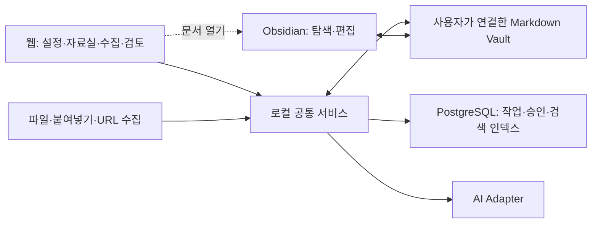

# Architecture — 2026-09-17 목표 설계

기존 Next.js/TypeScript/PostgreSQL/Vault를 유지합니다. 아래 서비스 경계는 목표이며 현재 구현 상태는 ACTIVE.md를 확인합니다.

## 한 엔진, 여러 사용 화면

```text
Obsidian 명령 / CLI / Control Tower
                 │ 동일한 작업 요청·결과 계약
                 ▼
        Knowledge Application Service
        Capture → Article → 선택적 Wiki
          │          │             │
      File Adapter  Model Adapter  Approval / Apply
          │          │             │
   Markdown Vault    AI       PostgreSQL 작업 상태
          └──── 필요한 부분 검색 → 다음 작업 ────┘
```

- packages/knowledge: 처리 유스케이스, 문서·출처·변경계획 계약과 파일 검색/저장 Adapter. 기존 인터페이스에서 실제 구현으로 확장합니다.
- packages/kernel: 공통 식별·승인·상태 전이. 특정 주제의 프롬프트를 넣지 않습니다.
- packages/database: migration과 repository, 작업/승인/이벤트 저장.
- apps/worker: 지속 가능한 작업 실행. 현재 demo.ts는 데모이며 운영 Worker가 아닙니다.
- apps/control-tower: 조회와 요청·검토 화면. 별도 AI 처리 로직을 중복 구현하지 않습니다.
- Obsidian: 작성·탐색 UI와 얇은 명령 Adapter. API 키·모델 호출을 플러그인마다 중복 관리하지 않습니다.
- packs/marketing: 동일 서비스를 사용하는 GEO/AEO 업무 규칙. 공통 Kernel과 독립적입니다.

개인 KnowledgeOS의 원문 보존, 중복 감지, 글쓰기 규칙, 날짜별 로그, 단계적 검색을 재사용합니다. 개인의 데이터·경로·주제 분기와 거대한 QuickAdd 스크립트를 그대로 복제하지 않고 계약과 테스트 사례부터 옮깁니다.

## 웹과 Obsidian의 연결 방식

웹을 설정·수집·읽기·작업 관리의 기본 화면으로 사용합니다. 기존 Next.js Control Tower 뒤의 로컬 서비스가 파일·DB·모델 Adapter를 연결합니다. 별도 정적 HTML 파일에 키와 파일 쓰기 로직을 넣지 않습니다. 브라우저 파일 접근에는 권한과 API별 지원 조건이 있으므로 브라우저만으로 Vault 관리 전체를 해결한다고 가정하지 않습니다. [File System API](https://developer.mozilla.org/en-US/docs/Web/API/File_System_API)



- **한 파일 정본:** 웹과 Obsidian은 같은 폴더의 Markdown을 사용합니다. 두 문서 저장소 사이의 양방향 복제를 만들지 않습니다. 첫 웹 자료실은 읽기/비교와 승인된 처리 결과 반영부터 제공하고 일반 본문 편집기는 보류합니다.
- **연결 등록:** workspace별 `vault_id`, 실제 경로, 포함/제외 폴더, 읽기/쓰기 범위, Obsidian 열기 정보를 로컬 설정에 둡니다. API는 클라이언트가 보낸 임의 절대 경로가 아니라 등록된 Vault/문서 ID를 해석합니다. 기존 개인 영역은 선택 범위 밖으로 탐색하지 않습니다.
- **기존 노트 호환:** ID나 frontmatter가 없는 Markdown도 읽습니다. 변경 감지는 선택된 폴더의 메타데이터·hash와 재생성 가능한 인덱스로 처리하고, 연결만으로 모든 노트에 속성을 쓰거나 AI를 호출하지 않습니다. 추적할 수 없는 이름 변경은 확정된 동일 문서처럼 추측하지 않습니다.
- **변경 반영:** 연결된 범위의 초기 목록 확인 후 파일 변경 감지와 재시작 시 재검사를 조합합니다. Obsidian 편집은 웹 검색/읽기에 갱신하되 읽을 때와 반영 직전 revision을 재확인합니다. 파일 삭제·경로 분리·동시 편집은 상태로 표시하고 자동 복원/덮어쓰지 않습니다. 모바일/다른 PC 동기화는 이 연결의 범위가 아닙니다.
- **Obsidian 열기:** 사용자가 버튼을 누르면 등록된 Vault와 문서 경로를 URI 인코딩해 `obsidian://open`으로 엽니다. URI는 열기 기능이며 문서 내용을 가져오는 API로 사용하지 않습니다. 최초 Vault 등록·앱 미설치·브라우저의 외부 앱 열기 동의는 안내합니다. Ctrl+P 처리는 이후의 얇은 플러그인 Adapter로 두며 웹 읽기/처리의 필수 설치 조건으로 만들지 않습니다. [Obsidian URI](https://obsidian.md/help/Extending%2BObsidian/Obsidian%2BURI)
- **웹 본문 수집:** 서버 Adapter가 허용된 HTTP(S) 출처를 가져와 본문·제목·원본 URL·수집 시점·추출 상태를 반환합니다. 크기/시간/리다이렉트 상한과 내부망 접근 제한을 둡니다. 미리보기는 스크립트를 실행하지 않는 정제된 콘텐츠이며, 로그인 세션을 임의로 공유하거나 추출 실패를 성공으로 저장하지 않습니다.
- **설정과 실행:** 설정 UI는 연결 상태와 비밀값을 분리합니다. 키는 서버 측 로컬 비밀 저장소/권한 제한 파일에 두고 browser storage나 Vault에 저장하지 않습니다. 신규 설정 쓰기는 로컬 세션·origin 확인 뒤 처리합니다. 기존 `.env.local` 연결을 깨지 않고 마스킹된 설정 상태로 표시합니다.
- **설치 범위:** 로컬 실행기가 웹·Worker·PostgreSQL의 상태 확인, 시작/종료와 설정 유지까지 관리하도록 설계합니다. OS별 실행 패키지와 DB 초기화·업그레이드·복구 방식은 검증이 필요합니다. 현재는 개발 명령으로 실행하며 자동 설치/DB 준비가 구현된 상태가 아닙니다. 중앙 클라우드 서비스가 사용자의 로컬 Vault에 직접 접근하는 제품으로 오인하지 않습니다.

현재 `/`와 `/api/vault`는 로컬 Vault 연결·목록/본문 읽기·파일/본문 Raw 저장을 제공합니다. 기존 Demo/초기 DB 조회는 `/operations`와 `/api/dashboard`에 있습니다. 연결 전만 탭 메모리 미리보기이며 연결 후 문서 정본은 Markdown입니다.

- `packages/knowledge/src/vault-library.ts`: 선택한 폴더만 순회하고 숨김/심볼릭 링크를 제외합니다. 최대 300문서·3,000항목·깊이12, 파일별 8 KB header/미리보기 → 선택한 문서 전체 읽기 순서입니다. 현재 검색은 목록의 제목·태그·경로·본문 앞 1,200자이며 전체 검색/인덱스/변경 감지는 없습니다.
- 목록 ID는 상대 경로 hash이므로 이름 변경은 새 목록 항목입니다. Raw 출처 ID와 혼동하지 않습니다. 연결 ID는 canonical root·범위·쓰기 권한 hash로, 다른 탭에서 설정이 바뀌면 이전 읽기/저장 요청을 거부합니다.
- `captureSource`는 CLI와 같은 Raw 보존·중복·잠금 경로를 재사용합니다. 동기 원문 저장만 수행하며 AI·Article·DB job을 만들지 않습니다. 기존 문서의 수정/삭제 API는 없습니다.
- `lib/vault-server.ts`: 실행 디렉터리의 `.business-os/vault.json`에 연결 설정을 원자적으로 저장합니다(신규 디렉터리 0700, 파일 0600). 기본 pnpm 명령의 실행 디렉터리는 `apps/control-tower`입니다. 테스트 Vault도 그 아래 격리하며 `.business-os/` 전체는 Git 제외입니다. 설정 파일은 문서/작업 상태 DB가 아닙니다.
- API는 loopback host·custom header·origin을 검사하고, 쓰기에는 HttpOnly/SameSite 세션을 추가 확인합니다. 재시작 후 bootstrap으로 세션을 갱신합니다. 로컬 프로세스 권한·사용자 인증·다중 사용자 격리를 대체하지 않습니다.
- Obsidian URI는 등록된 파일의 절대 경로를 인코딩합니다. 같은 Vault를 Obsidian에 먼저 등록해야 합니다. 편집 변경은 수동 새로고침으로 확인합니다. macOS Safari → Obsidian 열기/편집 → 웹 수동 갱신을 검증했습니다. 내부 브라우저의 외부 앱 실행 제한에는 일반 브라우저에서 여는 경로를 안내합니다.
- 로컬 HTTP 응답이 멈추면 사용자가 계속 대기하게 되는 문제가 실제 검증에서 발생해 클라이언트 대기를 30초로 제한합니다. 쓰기 요청 취소는 서버 취소를 보장하지 않으므로 결과 미확인으로 안내하고 목록 재조회로 확인합니다. 자동 재전송은 하지 않습니다.

다음 연결은 지속 작업 조회·웹 AI 요청·승인 반영입니다. URL 수집과 AI 생성은 별도 요청으로 구분합니다. 위 목표의 자동 변경 감지·API 키 설정·로컬 실행기·설치 패키지는 남아 있습니다.

## 정본과 소유권

| 데이터 | 정본 | 다른 계층의 역할 |
|---|---|---|
| Raw/Article/Wiki/SOP/회사 목표 | Markdown 파일 | DB는 ID·경로·revision·검색용 투영 |
| 작업·시도·승인·이벤트·사용량 | PostgreSQL | 웹 조회, 선택적 일일 로그 요약 |
| 모델 역할·라우팅·처리 정책 | config와 코드 | UI에서 유효 설정 표시 |
| 제품 개발 설계·상태 | docs와 루트 ACTIVE.md | 회사 Vault에 복제하지 않음 |
| 회사 업무용 현재 맥락 | vault/70_context | 작업에 필요한 경우만 로드 |
| API 비밀정보 | 환경/비밀 저장소 | Vault·Git·로그에 기록하지 않음 |

정리글의 전문을 파일과 DB 두 곳에서 편집 가능한 정본으로 관리하지 않습니다. 승인 대기 초안/변경 패치는 DB 작업 산출물이며 반영 이후 정본은 파일입니다. 검색 인덱스는 파일에서 재생성할 수 있어야 합니다.

Vault 경로는 배포 설정으로 분리하고, 저장소 안 vault는 현재 로컬 배치입니다. 유료 고객의 비공개 자료를 코드 저장소에 함께 배포하지 않습니다. 새 Vault 복제는 공통 템플릿·버전만 공유하며 API 키·개인 데이터·작업 DB는 복제하지 않습니다.

## 문서와 입력 계약

- 문서 identity: vault_id + doc_id. 파일명은 날짜-제목을 사용해도 ID는 바뀌지 않습니다.
- content_hash는 내용 중복 확인용, revision_hash는 동시 편집 확인용으로 구분합니다.
- 공통 속성: kind, title, domain, source_refs, created/updated, 필요한 처리 상태. 모든 종류에 같은 속성을 강제하지 않습니다.
- Raw 추가 속성: source_type, source_url(있을 때), capture_method, captured_at, content_mode(full/excerpt/pointer), source hash.
- source_type과 domain은 서로 독립입니다. 매체마다 핵심 처리 엔진을 새로 만들지 않습니다.
- 날짜는 수집일과 게시일을 구분하며 모르는 게시일은 채우지 않습니다.
- 원문 추적 링크는 사람이 읽을 제목을 표시하고 내부 참조는 stable ID로 해석합니다.
- 파일 이동 시 링크와 ID 인덱스를 함께 검사합니다. Raw 본문은 수정하지 않고 새 자료 버전은 새 snapshot으로 보존합니다.
- 아직 확보하지 않은 URL/대화 참조를 읽은 본문처럼 처리하지 않습니다. ChatGPT 참조는 별도 가져오기 절차가 필요합니다.
- 모델 입력에 들어온 문서의 명령문은 처리 대상 데이터이지 실행 권한이 아닙니다.

## 첫 처리 경로

1. Capture: 입력 범위·파일 형식·본문 유무 확인. 동일 입력 재시도는 기존 결과로 연결.
2. Raw: 입력 원형과 출처를 보존. Raw가 안전하게 보존되기 전 Inbox를 제거하지 않음.
3. Article: 글쓰기 프로필을 적용. 긴 자료는 분할 처리와 합본 대조; 사례·수치·코드·원문 유의점 누락 검사.
4. Write: 신규 Article은 요청한 작업 범위로 생성. 같은 문서의 수동 변경은 보존.
5. Wiki: Article로 충분하면 생성 0개. 필요한 경우 기존 문서 검색 후 좁은 변경 계획을 제시.
6. Apply: 승인한 파일·내용·기준 revision만 적용. 승인 뒤 문서가 바뀌면 재검토.
7. Retrieve: Article/Wiki에서 관련 구간을 가져와 실제 후속 질문에 사용.

새로운 개념 파일을 모든 키워드마다 만들지 않습니다. 생성 범위는 preview에 표시하고 예상보다 확장되면 재승인합니다. TXT·별도 검증 보고서·별도 실행 MD는 요청이 있을 때만 만듭니다. 일상 로그는 작업공간 시간대의 날짜별 한 파일에 append하고 event ID로 중복을 방지합니다. 세부 실행 이력은 DB에서 관리합니다.

## 작업 지속성과 파일 반영

첫 버전은 단일 Worker로 충분합니다. 분산 큐 서비스나 다중 Agent부터 넣지 않습니다.

- 작업 요청은 workspace + 입력 ID/hash + 처리 목적/설정 버전을 포함한 idempotency key로 중복을 제어합니다.
- 작업과 개별 시도를 구분합니다. 재시도는 실패 구간부터 이어가고 무조건 AI 재호출하지 않습니다.
- 대기/실행/사용자 확인 필요/성공/실패/취소 상태와 실패 이유를 영속화합니다. 장시간 실행의 중단 여부를 확인할 수 있도록 lease 또는 heartbeat를 둡니다.
- 예산·시간·시도 횟수 상한을 설정합니다. 본문 없음/권한 오류/충돌을 무한 재시도하지 않습니다.
- 모델 결과는 구조·경로·길이·참조를 검사한 뒤 저장합니다. 모델에게 임의 파일 쓰기 권한을 주지 않습니다.

파일 변경과 DB transaction은 하나의 원자적 commit이 아닙니다. 처음에는 소규모 write-intent 기록과 복구 절차로 해결합니다.

1. DB에 목표 파일, 기준/결과 hash, 승인 ID, 작업 ID를 기록.
2. 허용 Vault 내부의 실제 경로를 확인하고, 같은 파일시스템의 임시 파일로 준비.
3. 수동 변경을 감지하고 보호된 교체 수행. Vault 내 자체 쓰기는 직렬화하고 Obsidian 외부 편집과의 충돌은 재검토로 처리.
4. 결과 hash를 확인한 뒤 DB에서 완료 처리.
5. 중간 종료 시 intent와 실제 파일을 비교해 완료·재시도·사용자 확인으로 복구. 다중 파일은 단계별 상태와 필요한 before-image를 보존.

hash 확인만으로 모든 외부 편집 경쟁을 제거했다고 주장하지 않습니다. 장애 주입·동시 편집 테스트로 무손실 조건을 검증하고 충돌 시 자동 덮어쓰지 않습니다. '정확히 한 번' 실행을 약속하기보다 반복 실행해도 결과가 중복되지 않는 것을 검증합니다.

## PostgreSQL과 승인

- LLM·네트워크 호출 동안 DB transaction/row lock을 유지하지 않습니다.
- 프로세스별 재사용 pool을 두고 요청마다 만들고 닫지 않습니다.
- migration ledger, 순서·checksum·동시 실행 보호를 두며 'CREATE IF NOT EXISTS'만으로 버전 변경을 처리하지 않습니다.
- workspace 범위는 repository뿐 아니라 관련 외래키/unique 제약에서도 일관되게 유지합니다.
- 승인은 actor, workspace, 대상 작업, 변경 payload hash, 기준 문서 revision에 연결합니다. 단순 approved 문자열은 실행 권한이 아닙니다.
- 승인 UI는 실제 diff·영향 범위를 보여줍니다. 변경·만료·반려된 계획은 실행할 수 없습니다.
- 로컬 쓰기 UI도 loopback 노출 범위·origin·로컬 세션/페어링을 확인합니다. env의 actor 이름을 인증으로 취급하지 않습니다.
- 원격/팀 배포 전 로그인, 소속·권한, 비공개 Vault 격리, 교차 workspace 테스트를 추가합니다. RLS를 쓰면 DB owner/bypass 역할과 실제 앱 역할의 차이도 검증합니다.

운영 DB의 트랜잭션 rollback·동시 승인·제약·재시작은 실제 PostgreSQL에서 테스트합니다. 메모리 FakeDatabase 테스트만으로 완료 판정하지 않습니다.

현재 구현(2026-09-17): `packages/database/src/migrations.ts`가 명시적 manifest와 원본 SQL의 SHA-256을 사용합니다. `business_os_migrations`를 만들기 전부터 transaction advisory lock을 잡아 첫 설치까지 직렬화합니다. 적용 이력은 manifest의 연속된 앞부분과 일치해야 하며 checksum·순서·알 수 없는 버전은 거부합니다. 미적용 SQL과 이력 추가는 한 transaction으로 반영하고 오류 시 함께 취소합니다. 기존 001 파일의 바이트는 유지하며 실행 시 바깥 BEGIN/COMMIT만 제거합니다. 합성 seed 002는 자동 적용하지 않습니다. [PostgreSQL advisory locks](https://www.postgresql.org/docs/current/explicit-locking.html#ADVISORY-LOCKS)

이력 없는 기존 public schema는 추측으로 채택하지 않습니다. IF NOT EXISTS만으로 설치 성공을 기록하면 다른 형태의 기존 테이블도 정상으로 오인할 수 있기 때문입니다. 새 빈 DB에서 시험하고, 기존 데이터 보존 업그레이드는 백업·schema 검토 후 별도 baseline 경로가 필요합니다. 현재 checksum은 적용 SQL의 변경을 검출하며 수동 DDL drift 전체를 탐지하지 않습니다.

003 migration은 `learning_items(workspace_id, source_run_id)`를 같은 workspace의 Loop에 묶습니다. 원본 Loop 삭제 시 source 참조만 null이 되고 workspace는 유지됩니다. 기존 잘못된 참조는 자동 수정하지 않고 migration을 실패시킵니다. 이는 해당 관계의 무결성 제약이며 다중 사용자 권한/RLS 완성을 뜻하지 않습니다.

Control Tower는 프로세스 내 공유 pool(최대 5연결)을 개발 중 모듈 재로딩에도 재사용합니다. 연결 획득 5초, SQL/idle transaction 60초 제한을 두며 idle 연결 오류에서는 비밀값 없이 상태만 기록합니다. migration lock 대기는 10초입니다. 설정 변경 시 서버를 재시작하며 CLI는 독립 pool을 종료합니다. rollback 자체가 실패한 연결은 풀에 돌려보내지 않습니다. [node-postgres pooling](https://node-postgres.com/features/pooling)

실제 PostgreSQL 18.6에서 자동 통합 검증과 별도 서버 재시작 검증을 수행했습니다. 재현 명령은 [CONTRIBUTING](../CONTRIBUTING.md#live-database-verification)에 있습니다. job/attempt/event·사용량 저장은 아래와 같이 연결했으며 Worker 복구 완료를 뜻하지 않습니다.

### 현재 처리 작업 저장 — M2.1 두 번째 구현

`process-job.ts`는 DB에 의존하지 않는 `ProcessingJobStore` 계약으로 기존 `processSource`를 감쌉니다. `ProcessingJobRepository`와 004 migration은 요청/job, attempts, events, model_calls를 저장합니다. CLI `--track-job`로 선택하며 웹 Raw 저장을 자동 AI/DB 작업으로 바꾸지 않습니다. 본문·초안 전문·키를 DB 이벤트에 복사하지 않고 hash와 결과 문서 참조를 기록합니다.

workspace + canonical Vault 경로 hash + 기존 source/policy request hash에 unique 제약을 둡니다. job row lock으로 claim/완료/취소를 직렬화하고 실행 중 attempt는 job당 하나입니다. attempt·event·model call은 workspace/job 복합 FK로 묶습니다. 첫 요청의 시도 상한은 고정(기본 3, 1~5)하며 실패 중 재시도 가능 항목만 명시적 `--retry`로 실행합니다. 완료 중복은 저장 결과를 반환하므로 현재 파일의 존재/수정 여부를 재검증한 결과가 아닙니다. 파일 정본 검사는 실제 읽기/처리 시 수행합니다.

모델 호출 직전에 started를 기록하고 응답 사용량은 출력 품질 검사 전에 저장합니다. 앞 구간이 성공한 뒤 뒤 구간이 실패하거나 출력이 거부되어도 받은 토큰 수를 보존합니다. 응답 손실/잘못된 usage는 null/unknown이며 needs-review로 둡니다. 호출 기록을 저장하지 못하면 추가 호출을 중단하고 상태를 안전한 재시도로 추측하지 않습니다. 모의 API 테스트로 검증했으며 이번 단계의 유료 호출은 없습니다.

취소는 DB 요청 플래그를 500ms 간격과 처리 경계에서 확인하는 협력적 방식입니다. 게시 직전 확인 뒤 실제 파일 쓰기 사이까지 원자적으로 막지는 못합니다. 완료한 파일/성공은 뒤늦은 취소로 지우거나 실패로 바꾸지 않습니다. 강제 종료나 DB 기록 불명 시 running/started가 남으며 자동 claim하지 않습니다. `knowledge:job`은 최근 50개와 개별 이력을 읽어 이런 작업을 찾습니다. 입력은 재실행 CLI가 다시 제공하며 백그라운드 queue 소비자는 아직 없습니다. lease/heartbeat·checkpoint·write intent·검토 후 복구는 다음 단계로 남습니다.

## Context와 AI 비용

기본 로드는 짧은 Router/관련 작업 규칙이며, 검색은 metadata → capsule → 관련 section → 필요한 Raw 순입니다. 회사 목표도 회사별 판단에 필요한 때만 읽습니다.

작업별 모델 호출은 하나의 중앙 Adapter를 통합니다. 초기에는 검증된 모델 하나로 시작하고, deep/execution/check 역할별 분리는 품질·비용 비교 후 적용합니다. 특정 모델의 표시 이름을 API ID라고 가정하지 않습니다.

입력/출력 토큰·소요 시간·성공/재시도·사용한 모델/정책 버전을 기록합니다. 비교 가능한 동일 자료·품질 기준 없이 토큰 절감률을 주장하지 않습니다. Context는 기본적으로 일시적이며 사용자가 저장·전달할 때만 파일을 만듭니다. 원문·전체 prompt·키를 실행 로그에 무조건 복사하지 않습니다.

## 현재에서 전환

현재 M2.1 첫 구현은 source-article.ts 공통 서비스 + markdown-vault.ts + openai-article.ts + process-source.ts CLI입니다. ID/해시/정책을 문서 산출물에 기록하며, 파일 생성은 같은 디렉터리의 임시 파일과 배타적 hard-link로 게시합니다. 기존 문서 교체는 지원하지 않습니다. 탐색은 Raw/Article 폴더의 bounded header를 읽고 ID가 맞는 본문만 읽습니다. DB 인덱스와 증분 조회는 후속입니다.

잠금은 단일 로컬 명령의 중첩 쓰기를 막는 파일 잠금이며 지속 작업 상태가 아닙니다. 중간 API 실패 시 Raw 유지, 완성 Article 재사용과 로그 보완은 가능하지만 강제 종료 잠금·구간별 AI 결과·부분 로그 복구는 아직 자동화되지 않았습니다. 위 PostgreSQL/write-intent 설계를 연결하기 전까지 운영 Worker 완료로 판정하지 않습니다.

기존 승격 스크립트는 Inbox의 수동 제안서를 만들 뿐입니다. 새 승인 흐름이 구현되기 전까지 이를 자동 반영 기능으로 설명하지 않습니다. 구현 때 기존 수동 제안을 import할 수 있게 하되, Markdown 체크박스와 DB 승인 상태를 동시에 권한의 정본으로 삼지 않습니다.

공개 Vault는 합성 예제·템플릿입니다. 실제 회사 지식은 저장소 밖의 별도 Vault에 보관하고 제품 설계와 구별합니다.

## 개선 순서와 채택 기준

모델 업그레이드만으로 저장·복구·문서 품질 문제가 해결된다고 가정하지 않습니다. 현재 검증할 수 있는 결함부터 개선하고, 아래 후보를 구현 완료 기능으로 설명하지 않습니다.

| 상태·시점 | 해결할 문제 | 개선 방향과 확인할 근거 |
|---|---|---|
| 확정 방향 · M2.1 | 파일 잠금만으로는 작업 중단·재시도·과금 이력을 복구할 수 없음 | PostgreSQL 작업/시도/사용량, lease, 구간 checkpoint, write intent. 강제 종료와 재시작에서 보존·중복·불명 상태를 검증 |
| 확정 방향 · M2.1 | 분할 성공·코드 보존만으로 내용 충실성을 보장하지 못함 | 같은 원문에서 사례·수치·조건·앞/중간/끝 보존과 합본 문체 평가. 사용자의 수정 부담까지 기록 |
| 확정 방향 · M2.2 | CLI·Obsidian·웹이 각각 다른 결과/승인을 만들 위험 | 요청·상태·출처·변경 diff를 하나의 공통 서비스로 연결하고 승인 이후 수정 충돌을 검증 |
| 확정 방향 · M2.2 | 현재 폴더별 header 탐색과 경로 링크의 한계 | workspace/Vault 식별, ID·revision·경로 투영과 증분 갱신. 이름/위치 변경 및 인덱스 재생성 후 같은 문서와 출처를 찾는지 검증 |
| 비교 후 채택 | 모델별 품질·속도·비용 차이 | 고정 자료와 글쓰기 기준으로 현재 모델과 후보를 비교. 우세가 확인된 역할에만 교체/분리하고 모델·정책 버전을 보존 |
| 문제 확인 후 검토 | 자료가 쌓이며 부분 검색의 재현율/속도가 부족해짐 | 먼저 실제 검색 실패를 수집. 필요할 때 QMD·벡터 검색·재순위화를 비교하며 새 저장소를 선행 도입하지 않음 |
| 보류 | 실제 업무가 검증되기 전 자동화 복잡도 증가 | 다중 Agent·의미 캐시·n8n·Industry Pack은 반복되는 문제와 측정 가능한 이득이 생긴 뒤 추가 |

품질 평가용 원문과 실제 회사 문서는 비공개 영역에 둡니다. 공개 테스트에는 합성·재배포 가능한 사례만 남기고, 비용 비교에는 문자 수 추정과 API가 반환한 실제 토큰 수를 구분합니다.
